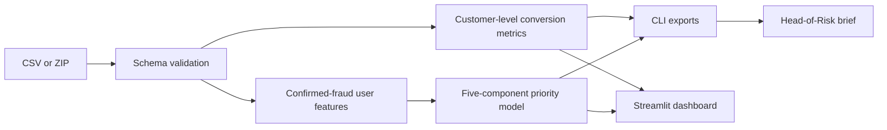

# Growth & Financial-Crime Risk Audit

A reproducible Python repository that answers two management questions from `fin_crime_data.csv`:

1. **Growth audit:** Why does Marketing report approximately 78.2%, and what stricter rate better reflects sustainable behaviour?
2. **Bonus challenge:** Which five confirmed-fraud users deserve the highest investigative priority when raw transaction volume or presumed loss is not enough?

The repository includes a command-line analysis, a Streamlit dashboard, deterministic output files, tests, and an explicit model-governance document.

**Executive report:** [Download the five-page Head-of-Risk Investigation Priority Brief](reports/head-of-risk/Head_of_Risk_Investigation_Priority_Brief.pdf).

## Executive results for the supplied dataset

| Question | Result |
|---|---|
| Marketing reconstruction | **78.17%** = 5,463 / 6,989 observed KYC-PASSED users with at least one card-payment row |
| Matured one-event quality proxy | **75.30%** = 5,263 / 6,989 after excluding users with any confirmed fraud |
| Stricter sustainable-behaviour proxy | **71.74%** = 5,014 / 6,989 with at least two card-payment rows and no confirmed fraud |
| Difference | **−6.42 percentage points**: 200 users removed by the fraud screen and 249 by the repeat-use requirement |
| Confirmed-fraud population | **14,543 events across 299 users** |

The 71.74% result is a **current-file sensitivity**, not a true app conversion or retention rate. The source has no app-install/signup cohort, timestamps, settlement status, chargebacks or fixed fraud-maturation window.

## Top 5 Head-of-Risk investigation targets

The model ranks only users with at least one confirmed-fraud event. Raw mixed-currency amount is not summed or treated as realised loss. Behavioural persistence, statistical conviction, abnormality and attack breadth contribute 90% of the score; currency/type-normalised amount severity contributes 10%.

| Rank | User ID | Priority score | Confirmed events | Fraud methods | Merchant countries | Amount-severity-only rank |
|---:|---|---:|---:|---:|---:|---:|
| 1 | `dc283b17-bbe1-4ae9-a11c-0029d5ae71d9` | 99.4 | 1,029 | 5 | 11 | 1 |
| 2 | `b8271606-4633-4d8f-8729-a2c8ebb8a49f` | 97.8 | 340 | 5 | 3 | 6 |
| 3 | `25c2ecb3-5ec7-4fa6-8fc3-bbcf3a691217` | 97.6 | 460 | 5 | 5 | 31 |
| 4 | `5c75c857-61f0-400e-ac7b-25451c57e8de` | 96.6 | 238 | 5 | 3 | 20 |
| 5 | `4ee8690a-ebf7-435b-9fe2-103e8f83edc6` | 96.0 | 508 | 5 | 8 | 84 |

The fifth target is the clearest demonstration of the strategy: despite ranking only 84th on amount severity, the user has 508 confirmed events across all five transaction types and eight merchant countries. By contrast, `1632f5e0-e2da-4668-b487-5cc897b963d3` ranks second on amount severity but only 91st overall because it has 41 confirmed events, three methods and one merchant country. This is why the priority list is not a disguised volume ranking.

See [`outputs/head_of_risk_brief.md`](outputs/head_of_risk_brief.md) for the complete rationale and [`docs/METHODOLOGY.md`](docs/METHODOLOGY.md) for formulas and governance.

## Run options

| Approach | Trade-offs | Cost | Setup complexity |
|---|---|---:|---:|
| **Command-line analysis** | Fastest deterministic export; no interactive exploration | Local compute only | Low |
| **Interactive dashboard** | Upload or point to a dataset; inspect the growth bridge, risk overview, Top 5 and challengers | Local compute only | Low–moderate |

Both routes use the same package functions and `risk_model.json`, so dashboard and export results cannot drift.

## Quick start

### 1. Clone and create the environment

```bash
git clone https://github.com/Razije/revolut-fincrime-growth-risk-audit.git
cd revolut-fincrime-growth-risk-audit
python3 -m venv .venv
source .venv/bin/activate
pip install --upgrade pip
pip install -r requirements.txt
```

### 2. Add the dataset

Copy `fin_crime_data.csv.zip` or `fin_crime_data.csv` into `data/`. Raw data are git-ignored by design.

### 3. Generate the analysis outputs

```bash
python run.py analyse --data data/fin_crime_data.csv.zip --output outputs
```

This writes:

- `outputs/audit_summary.json`
- `outputs/fraud_priority_ranking.csv`
- `outputs/top_5_priority_targets.csv`
- `outputs/high_severity_not_selected.csv`
- `outputs/head_of_risk_brief.md`

### 4. Run the dashboard

```bash
python run.py dashboard --data data/fin_crime_data.csv.zip --port 8501
```

Open <http://localhost:8501>.

The dashboard also accepts a CSV or ZIP through its upload control. If no `--data` path is configured, run Streamlit directly and upload the file:

```bash
streamlit run app.py
```

### 5. Run tests

```bash
pytest
python scripts/verify_supplied_data.py --data data/fin_crime_data.csv.zip
```

The integration verifier checks the supplied dataset’s row count, user count, conversion numerators and exact Top 5 IDs.

## Repository structure

```text
.
├── app.py                              # Streamlit dashboard
├── run.py                              # Main CLI entry point
├── risk_model.json                     # Versioned weights and modelling choices
├── src/fincrime_audit/
│   ├── io.py                           # ZIP/CSV loading and schema validation
│   ├── metrics.py                      # Growth and portfolio risk metrics
│   ├── scoring.py                      # Explainable Top 5 ranking
│   └── reporting.py                    # CSV/JSON/Markdown exports
├── scripts/verify_supplied_data.py     # Dataset-specific integration checks
├── tests/test_audit.py                 # Unit tests
├── docs/METHODOLOGY.md                 # Model rationale and controls
├── data/README.md                      # Input contract; raw data excluded
└── outputs/                            # Reproducible committed results
```

## Architecture



## Risk-priority model

| Signal | Weight | Purpose |
|---|---:|---|
| Repeatability | 30% | Prioritises persistent confirmed-fraud activity |
| Conservative fraud-rate conviction | 25% | Uses a 95% Wilson lower bound so one event is not treated like hundreds |
| Abnormality versus transaction mix | 20% | Compares observed fraud events with the number expected from global type-level fraud rates |
| Attack breadth | 15% | Rewards multi-method and cross-market patterns that may scale or evade single-control responses |
| Normalised amount severity | 10% | Preserves severity without summing mixed currencies or mislabelling transaction amount as loss |

Model weights are configurable in [`risk_model.json`](risk_model.json). The ranking deliberately excludes birth year, home country and other demographics. Merchant country measures observed attack breadth only; it does not identify attacker nationality.

## Governance and safe use

This output is an **investigative triage queue**, not a determination of guilt and not an automated decision rule. A trained investigator should review underlying events, linked accounts, devices, counterparties, case outcomes, customer-contact history and potential victimisation before any restriction, filing or customer-impacting action.

For the growth KPI, retain the 71.74% figure as an internal sensitivity. A production external metric should use a frozen KYC-approved/product-eligible cohort, settled non-reversed transactions on distinct days, a defined retention window and a separately labelled financial-crime maturity outcome.

## Data privacy

Do not commit raw customer data. The `.gitignore` blocks CSV and ZIP files under `data/`. The committed outputs contain pseudonymous user IDs because the challenge requires a reviewable Top 5; keep the repository private and apply your organisation’s access-control and retention policy before substituting production data.
